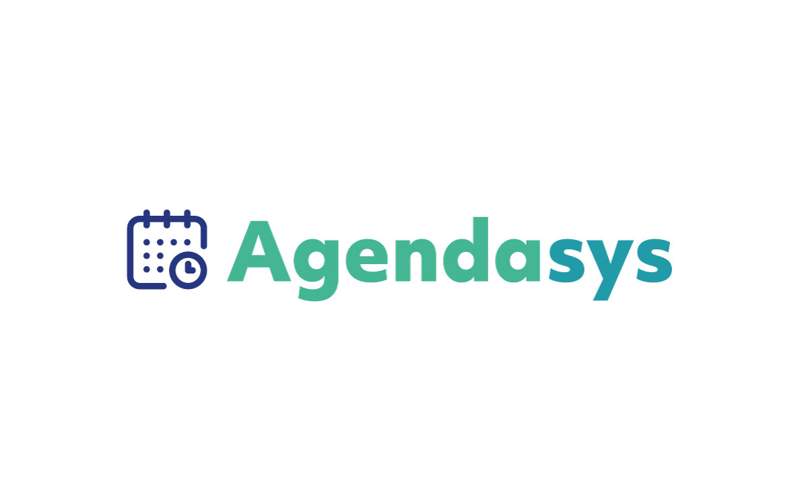

## AgendaSys

Aplicação PWA do sistema de agendamento AgendaSys. Feito com React.js. Este aplicativo tem por objetivo facilitar agendamentos de consultas e exames sem perder muito tempo, comunicação mais precisa, sem prejudicar o paciente. Melhor controle no fluxo de atendimento e maior eficiência  na comunicação entre clinicas/hospitais e pacientes.

### Veja uma demo
Ver [Demonstração](https://agendasys.herokuapp.com/home)

### 📋 Pré-requisitos

Será necessário instalar o [Node.js](https://nodejs.org/en/) e assim executar as dependências desse projeto seguindo as orientações da seção **instalação**.

### 🔧 Instalação

Aqui o passo-a-passo que deve ser seguido

```
yarn install
```

Agora para rode a aplicação local:

```
yarn start
```

Irá iniciar direto no navegador pelo endereço http://localhost:3000/


## Licença:
<p xmlns:dct="http://purl.org/dc/terms/" xmlns:cc="http://creativecommons.org/ns#" class="license-text">Esta obra está licenciada com uma Licença  <a rel="license" href="https://creativecommons.org/licenses/by-nc-nd/4.0">CC BY-NC-ND 4.0</a></p>
